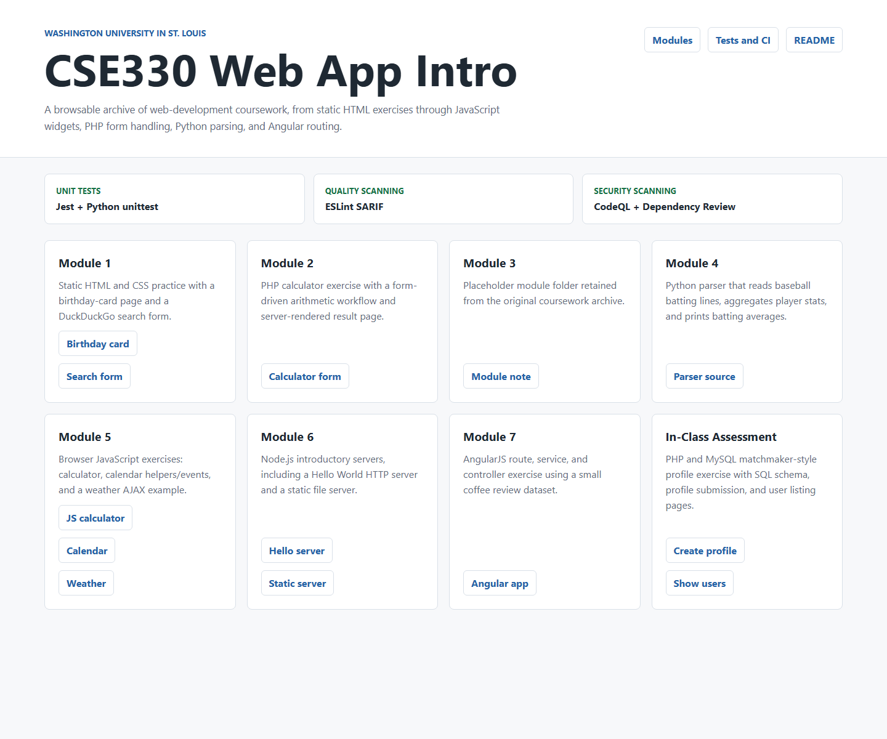

# CSE330 Web App Intro

This repository is an archived coursework/practice repository for **CSE330S: Rapid Prototype Development and Creative Programming** at Washington University in St. Louis. It collects small assignments and in-class exercises that introduce static HTML/CSS, PHP, Python parsing, browser JavaScript, Node.js servers, AngularJS routing, and a PHP/MySQL form workflow.

The repo now also includes a lightweight root interface at `index.html` that links the modules together and summarizes the automated quality checks.

## Repository Map

| Area | What it contains | Notes |
| --- | --- | --- |
| `Module1/` | Static HTML/CSS exercises | Birthday card page and DuckDuckGo search form. |
| `Module2/` | PHP calculator | HTML form posts arithmetic inputs to a PHP result page. |
| `Module3/` | Placeholder module | Contains only the original module readme marker. |
| `Module4/` | Python batting-average parser | Reads valid baseball stat lines, aggregates hits/at-bats by player, and prints sorted batting averages. |
| `Module5/` | Browser JavaScript exercises | Calculator, calendar helper/event logic, calendar UI, and a weather AJAX demo. |
| `Module6/` | Node.js server exercises | Hello World HTTP server and static file server examples. |
| `Module7/` | AngularJS route/service exercise | Coffee review dataset rendered through Angular routes/controllers. |
| `ICA/` | In-class PHP/MySQL assessment | Matchmaker-style profile form, SQL schema, profile listing, and age-range query pages. |
| `tests/` | Unit tests | Jest tests for Module 5 JavaScript and Python `unittest` tests for Module 4. |
| `.github/` | Automation | CI workflow, code scanning jobs, dependency review, and Dependabot update configuration. |

## Interface

Open `index.html` in a browser to use the repository dashboard. The page is intentionally static so it works without a build step and can be used as a quick table of contents for the class exercises.



## Unit-Tested Code

The repository did not originally include a repeatable test setup, so unit tests were added around the most testable course logic:

- `Module5/calculate.js`
  - Extracts `calculateResult(first, second, operation)` from the browser calculator so arithmetic behavior can be unit tested.
  - Tests addition, subtraction, multiplication, division, decimals, missing fields, invalid operations, divide-by-zero, DOM output updates, and event wiring.
- `Module5/calendar_helper.js`
  - Exposes `Week` and `Month` for Node-based tests while preserving browser usage.
  - Tests date offsets, Sunday calculation, week navigation, week membership, and month/week generation.
- `Module4/players.py`
  - Tests aggregation of valid player stat lines and sorted three-decimal output formatting.

## Local Setup

Prerequisites:

- Node.js 22 or newer
- npm 11 or newer
- Python 3.12 or newer

Install JavaScript test and lint dependencies:

```bash
npm install
```

Run the full test suite:

```bash
npm test
```

Run tests with JavaScript coverage:

```bash
npm run test:coverage
```

Run the quality lint baseline:

```bash
npm run lint
```

Current local verification result after the repo update:

- `npm run test:coverage` passes.
- Jest reports **100% line coverage** for the JavaScript files included in coverage collection.
- Python `unittest` reports 2 passing tests.
- `npm run lint` passes for the modernized/testable JavaScript baseline.

## GitHub Actions Pipeline

The workflow lives at `.github/workflows/ci.yml` and runs on pushes to `main`/`master` and on pull requests.

### Unit Tests

The **Unit Tests** job:

- Checks out the repository.
- Sets up Node.js 22 with npm caching.
- Sets up Python 3.12.
- Runs `npm ci`.
- Runs `npm run test:coverage`, which executes Jest coverage and Python unit tests.

### Code Scanning: Quality

The **Code Scanning / Quality** job:

- Runs ESLint against the modernized JavaScript/test baseline.
- Writes ESLint findings to SARIF using `@microsoft/eslint-formatter-sarif`.
- Uploads the SARIF file with `github/codeql-action/upload-sarif` so quality findings can appear in GitHub Code Scanning.

The lint baseline is intentionally scoped to `Module5/calculate.js`, `Module5/calendar_helper.js`, and `tests/js/*.test.js`. Some older assignment scripts share browser globals across multiple files; linting all of them without refactoring would produce noisy historical findings rather than useful CI feedback.

### Code Scanning: Security

The **Code Scanning / Security** job:

- Runs GitHub CodeQL for JavaScript/TypeScript and Python.
- Uses the `security-and-quality` query suite, while keeping the security scan in a separate job from the ESLint quality scan.

GitHub Code Scanning with CodeQL is free for public repositories. For private repositories, availability can depend on GitHub Code Security/GitHub Advanced Security settings.

### Dependency Review

The **Code Scanning / Security / Dependency Review** job runs on pull requests and uses `actions/dependency-review-action` to flag vulnerable or risky dependency changes before they are merged.

Dependency Review is available for public repositories and for private repositories when GitHub Code Security features are enabled.

### Dependency Automation

Dependabot is configured in `.github/dependabot.yml` to open weekly update pull requests for:

- npm dependencies
- GitHub Actions versions

## Notable Improvements Made

- Added a root dashboard interface (`index.html`, `site.css`) so the coursework can be browsed from one page.
- Added `package.json`, Jest, ESLint, and test scripts.
- Added unit tests under `tests/js/` and `tests/python/`.
- Refactored `Module5/calculate.js` into testable pure logic plus DOM wiring.
- Exported `Module5/calendar_helper.js` constructors for tests without changing browser behavior.
- Updated `ICA/database.php` to read database credentials from environment variables instead of hard-coding a password.
- Added GitHub Actions CI, CodeQL security scanning, ESLint SARIF quality scanning, Dependency Review, and Dependabot configuration.

## ICA Database Configuration

The in-class assessment PHP pages expect a local MySQL database created from `ICA/matchmaker.sql`. `ICA/database.php` reads these environment variables:

| Variable | Default |
| --- | --- |
| `MATCHMAKER_DB_HOST` | `localhost` |
| `MATCHMAKER_DB_USER` | `root` |
| `MATCHMAKER_DB_PASSWORD` | empty string |
| `MATCHMAKER_DB_NAME` | `matchmaker` |

For local historical coursework use, the defaults are enough if MySQL is configured that way. For any shared or deployed environment, set explicit credentials through the host or server environment.

## License

This repository includes a GPL-3.0 license file.
